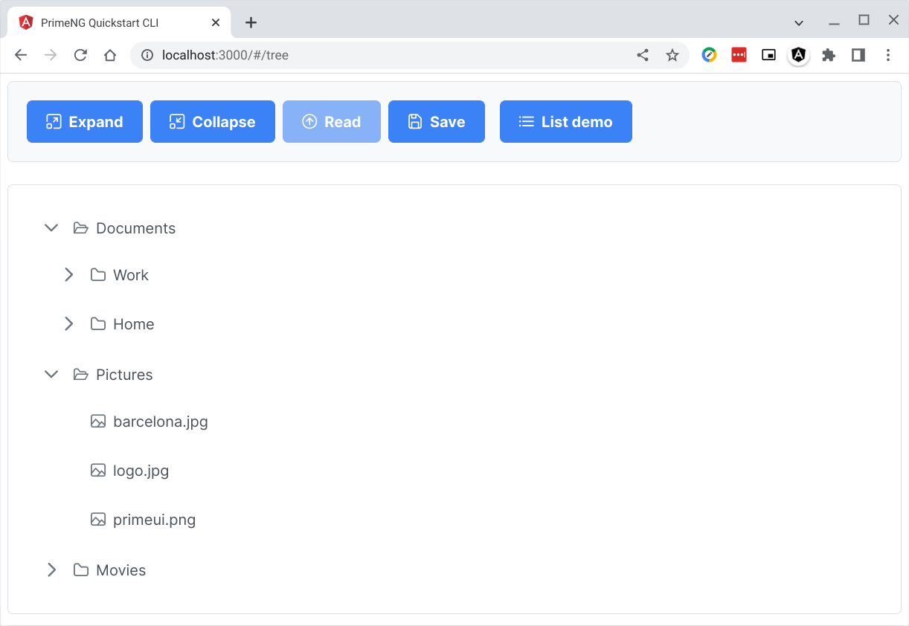

# go-post-json-passthru

## Go POST JSON passthru controller

> ***This tutorial requires some knowledge in Linux, Angular, and Go Programming Language.***

### Table of Contents
1. Introduction
2. Why passthru controller
3. Prerequisites
4. Clone this repo and run "npm install"
5. Compile Go server-side code
6. Client-side Angular code
7. Server-side Go code
8. Conclusion

### 1. Introduction

Oftentimes in our Angular web app we need to push JSON data to the server. Working with a tree data-structure can be a bit tricky. In this tutorial we will work with a tree component and send its JSON data to the server.

This tutorial builds from the previous tutorials. It is good to go thru them in sequence especially if you are new to Angular, Postgresql, and the Go programming language.

In the current iteration of this code, the tree component gets its data from a static file [src/client/src/assets/data/files.json](https://github.com/cydriclopez/go-post-json-passthru/blob/main/src/client/src/assets/data/files.json). Our goal, in this tutorial, is to push this data to a Go controller which, for now, merely prints the JSON data.

In the next tutorial we will call a Postgresql stored-function that walks-thru this JSON tree data and saves it into records in a table. In this tutorial we will cover just the very basics of JSON data processing using the tree component JSON data.

This is now our ***Tree demo*** app. Note that we have enabled the ***Save*** button. This ***Save*** button sends the tree JSON data to our server-side Go controller that for now just prints it on the console.<br/>
<kbd></kbd>


### 2. Why passthru controller

The Go standard library has excellent JSON processing features. However oftentimes the final destination of our JSON data is the database. Postgresql since version 9.2 has had the JSON data type. In the current version 14.2 Postgresql JSON features have improved a lot. We can just have Postgresql validate and save our JSON data.

It can be redundant to work with JSON in Go and then push it to Postgresql for more JSON processing. Sometimes this might be necessary. However, in this tutorial we will send our JSON data thru a Go controller which, for now, will merely grab the JSON data and print it in the server-side console. This is in preparation for the next tutorial where we will focus on the Postgresql code to walk-thru and pull apart the JSON data and save them as individual records in a table.

Postgresql JSON processing can infer the row parent-child relationships from the JSON structure and use the row id accordingly. We will see this code in the next tutorial. For now, we will follow the JSON data from the Angular component into the service which, using the HttpClient, calls the Go server-side controller.

### 3. Prerequisites

As mentioned before, this tutorial builds from the previous tutorials. I suggest you go thru them in sequence especially if you are new to Angular and the Go programming language.

I assume that you have a [working Angular](https://github.com/cydriclopez/docker-ng-dev) and [Go installation](https://github.com/cydriclopez/go-static-server#3-install-go). Please checkout the previous tutorials that cover these topics.

### 4. Clone this repo and run "npm install"

#### 4.1 Clone this repo then change into the repo folder.

You can follow the commands below. You may have to adjust according to your own chosen directory structure.

```bash
user1@penguin:~/Projects$
:git clone https://github.com/cydriclopez/go-post-json-passthru.git

user1@penguin:~/Projects$
:cd go-post-json-passthru/src/client

user1@penguin:~/Projects/go-post-json-passthru/src/client$
:pwd
/home/node/ng/go-post-json-passthru/src/client
```

#### 4.2 Modify your ***~/.bashrc*** file

You will have to alter the ***alias angular*** command in your ***~/.bashrc*** accordingly by adding another ***-v*** volume mapping. <ins>**Substitute your own path here.**</ins> However try maintain the container mapping into the ***:/home/node/ng/go-post-json-passthru*** folder.

```bash
# Setup Docker Angular working environment
alias angular='docker run -it --rm \
-p 4200:4200 -p 9876:9876 \
-v /home/user1/Projects/ng:/home/node/ng \
-v /home/user1/Projects/go-post-json-passthru/src/client\
:/home/node/ng/go-post-json-passthru \
-w /home/node/ng angular /bin/sh'
```

Reload the ***~/.bashrc*** file using the command: ***source ~/.bashrc***.

```bash
:source ~/.bashrc
```

#### 4.3 Run the ***Angular*** alias

Follow the commands below to run the ***angular*** alias. The prompt should change accordingly to notify you that you are in the Angular docker container.

```bash
user1@penguin:~/Projects/go-post-json-passthru$
:pwd
/home/user1/Projects/go-post-json-passthru

user1@penguin:~/Projects/go-post-json-passthru$
:angular

# Here you are now in the Angular docker container
/home/node/ng # ls -l
drwxr-xr-x    1 node     node           272 Aug  7 04:38 go-post-json-passthru
drwxr-xr-x    1 node     node           248 Jul 28 23:41 treemodule-json

/home/node/ng # cd go-post-json-passthru

/home/node/ng/go-post-json-passthru #
```

#### 4.4 Run "npm install"

Run ***npm install*** to install Angular and all requirements in ***node_modules*** folder.

```bash
/home/node/ng/go-post-json-passthru # npm install
...
[truncated Angular messages]
...
/home/node/ng/go-post-json-passthru #

```

#### 4.5 Run "ng build --watch"

Run "ng build --watch" to generate JavaScript static code in folder ***dist/project_name***. This is the folder we will host in our ***webserv*** Go server-side app.

```bash
/home/node/ng/go-post-json-passthru # ng build --watch

✔ Browser application bundle generation complete.
✔ Index html generation complete.

Initial Chunk Files | Names         |      Size
vendor.js           | vendor        |   3.61 MB
styles.css          | styles        | 241.78 kB
polyfills.js        | polyfills     | 216.88 kB
main.js             | main          |  60.28 kB
runtime.js          | runtime       |   6.40 kB

                    | Initial Total |   4.12 MB

Build at: 2022-08-10T21:07:52.958Z - Hash: ad769f193a142bd6 - Time: 9360ms
```

At this point Angular has "compiled" our client-side web app. The static files that Angular generated into the folder ***src/client/dist/primeng-quickstart-cli*** is ready for serving by our Go server-side app.

### 5. Compile Go server-side code

#### 5.1 Change directory into the Go server-side code

Here we will compile our Go server-side app. Here we will need to open another terminal tab where we can run our Go compiler. You can follow the steps here to [install the Go language compiler](https://github.com/cydriclopez/go-static-server#3-install-go).

With an installed Go compiler we can change directory into the Go server-side code. Follow the steps below.

```bash
user1@penguin:~/Projects/github/go-post-json-passthru$
:cd src/server

user1@penguin:~/Projects/github/go-post-json-passthru/src/server$
:ll

-rw-r--r-- 1 user1 user1   24 Aug  6 12:22 go.mod
drwxr-xr-x 1 user1 user1   18 Aug  2 13:24 params
-rw-r--r-- 1 user1 user1   24 Aug  9 01:56 README.md
drwxr-xr-x 1 user1 user1   22 Jul 31 12:16 treedata
-rw-r--r-- 1 user1 user1 1254 Aug  9 22:14 webserv.go

user1@penguin:~/Projects/github/go-post-json-passthru/src/server$
:go install

user1@penguin:~/Projects/github/go-post-json-passthru/src/server$
:which webserv
/home/user1/go/bin/webserv

user1@penguin:~/Projects/github/go-post-json-passthru/src/server$
:
```

#### 5.2 Run our Go server-side web app server

The above command ***go install*** read our ***webserv*** web server app, compiled it, then generated the executable in the folder ***~/go/bin***.

Make sure that the folder ***~/go/bin*** is in your path as [instructed here](https://github.com/cydriclopez/go-static-server#34-update-your-path). This is the default path where the Go compiler saves the executables generated from compiling your source code.

It used to be that Go required the setting of the ***GOPATH*** environment variable to function properly. This is not anymore the case with the new Go module system. The file ***go.mod*** tags the folder as a module which is a collection of related packages.

When running ***webserv*** we feed it the relative folder ***../client/dist/primeng-quickstart-cli*** which is the location of the Angular compiled static files. The default port is :3000.

```bash
user1@penguin:~/Projects/github/go-post-json-passthru/src/server$
:webserv ../client/dist/primeng-quickstart-cli
2022/08/10 19:06:07
Serving static folder: ../client/dist/primeng-quickstart-cli
Listening on port: :3000
Press Ctrl-C to stop server
```

### 6. Client-side Angular code


### 7. Server-side Go code
### 8. Conclusion

Please pardon my mess. Work in progress! 😊
---